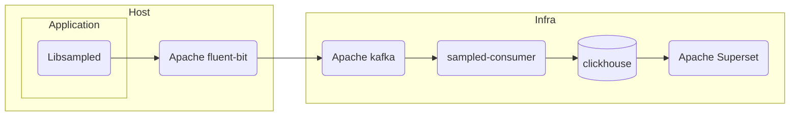

SampleD
---

Realtime event analytics capture and processor

- Emit samples from your application code (libraries provided)
- Configure fluentbit to capture samples on hosts
- Output from fluentbit to kafka
- Consume samples from Kafka in SampleD consumer
- SampleD will manage schema and store samples in ClickHouse
- Query/visualize with Apache Superset

## Infrastructure


## Consumer
```
go run ./consumer -logtostderr -sampled_config config.example.yaml
```

## Creating Samples
see example script in `libsampled/python/example`
